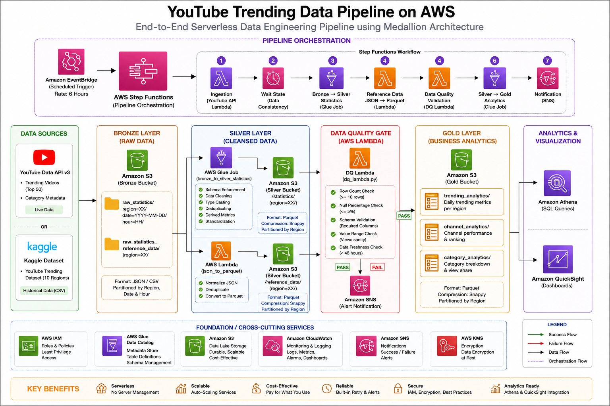

# 🎥 YouTube Trending Data Pipeline on AWS

An end-to-end serverless Data Engineering project that ingests YouTube Trending data, processes it through a Medallion Architecture (Bronze → Silver → Gold), performs automated data quality validation, and delivers analytics-ready datasets using AWS services.



---

# 📖 Project Overview

This project demonstrates how to build a scalable cloud-native data pipeline on AWS.

The pipeline collects YouTube Trending data from multiple regions using the YouTube Data API and historical Kaggle datasets, transforms raw data into optimized Parquet files, validates data quality, generates business-level analytics, and enables querying with Amazon Athena and dashboarding with Amazon QuickSight.

The entire workflow is orchestrated using AWS Step Functions and monitored through CloudWatch with SNS notifications for pipeline success or failure.

---

# 🏗️ Architecture

The project follows the **Medallion Architecture**.

```
Data Sources
     │
     ▼
Bronze Layer (Raw Data)
     │
     ▼
Silver Layer (Cleaned Data)
     │
     ▼
Data Quality Validation
     │
     ▼
Gold Layer (Business Analytics)
     │
     ▼
Athena / QuickSight
```

Pipeline orchestration is handled using **AWS Step Functions**.

---

# 🚀 Features

- End-to-End ETL Pipeline
- Serverless Architecture
- Medallion Data Lake Design
- Automated Data Quality Validation
- Glue Data Catalog Integration
- Athena Query Support
- QuickSight Dashboard Ready
- Event-Driven Processing
- SNS Email Notifications
- CloudWatch Monitoring
- Partitioned Parquet Storage
- Parallel Processing with Step Functions

---

# ☁️ AWS Services Used

| Service | Purpose |
|----------|---------|
| Amazon S3 | Data Lake Storage |
| AWS Lambda | Data Ingestion & Transformation |
| AWS Glue | ETL Processing |
| AWS Glue Crawler | Metadata Discovery |
| AWS Glue Data Catalog | Table Registration |
| AWS Step Functions | Workflow Orchestration |
| Amazon EventBridge | Pipeline Scheduling |
| Amazon Athena | SQL Analytics |
| Amazon QuickSight | Dashboard & Visualization |
| Amazon SNS | Alerts & Notifications |
| Amazon CloudWatch | Monitoring & Logs |
| AWS IAM | Security & Permissions |

---

# 🛠️ Tech Stack

- Python
- PySpark
- SQL
- AWS Lambda
- AWS Glue
- Amazon S3
- Amazon Athena
- AWS Step Functions
- Amazon SNS
- Amazon EventBridge
- CloudWatch
- AWS IAM
- Boto3
- Pandas

---

# 📂 Project Structure

```text
youtube-trending-data-pipeline/
│
├── architecture/
│   └── YouTube-Trending-Data-Pipeline.png
│
├── lambdas/
│   ├── youtube_api_ingestion/
│   └── json_to_parquet/
│
├── glue_jobs/
│   ├── bronze_to_silver.py
│   └── silver_to_gold.py
│
├── data_quality/
│   └── dq_lambda.py
│
├── step_functions/
│   └── pipeline.json
│
├── scripts/
│   └── aws_copy.sh
│
├── data/
│
└── README.md
```

---

# 📥 Data Sources

### YouTube Data API

- Live Trending Videos
- Category Metadata

### Kaggle Dataset

Historical YouTube Trending datasets used for backfilling and testing.

---

# 🥉 Bronze Layer

The Bronze layer stores raw data without modification.

Data includes:

- Raw JSON from YouTube API
- Historical CSV datasets
- Category reference JSON

Stored in Amazon S3.

---

# 🥈 Silver Layer

The Silver layer cleanses and standardizes the raw data.

Transformations include:

- Schema validation
- Data type conversion
- Duplicate removal
- Missing value handling
- Region standardization
- Derived metrics
- Conversion to Parquet

Output is stored in Amazon S3 and registered in AWS Glue Data Catalog.

---

# ✅ Data Quality Validation

Before loading data into the Gold layer, validation checks are performed.

Checks include:

- Minimum row count
- Required columns
- Null value threshold
- Schema validation
- Data freshness

If validation fails:

- Pipeline stops
- SNS sends failure notification
- Gold layer is not generated

---

# 🥇 Gold Layer

Business-ready datasets are generated.

## Trending Analytics

Daily regional trending statistics including:

- Total Videos
- Total Views
- Average Views
- Average Engagement Rate
- Like Ratio

---

## Channel Analytics

Channel performance metrics including:

- Total Trending Videos
- Total Views
- Average Engagement
- Regional Ranking

---

## Category Analytics

Category-level insights including:

- Total Videos
- Total Views
- Average Engagement
- View Share Percentage

---

# 🔄 Pipeline Workflow

```
YouTube API
      │
      ▼
Bronze Layer (S3)
      │
      ▼
Lambda + Glue
      │
      ▼
Silver Layer (S3)
      │
      ▼
Data Quality Check
      │
      ▼
Glue Aggregation
      │
      ▼
Gold Layer (S3)
      │
      ▼
Athena
      │
      ▼
QuickSight
```

---

# 📊 Analytics

The Gold datasets can be queried using Amazon Athena.

Example:

```sql
SELECT *
FROM channel_analytics
ORDER BY total_views DESC
LIMIT 10;
```

These datasets can also be visualized using Amazon QuickSight.

---

# 📁 Data Storage

```
Bronze
│
├── raw_statistics/
└── reference_data/

Silver
│
├── statistics/
└── reference_data/

Gold
│
├── trending_analytics/
├── channel_analytics/
└── category_analytics/
```

---

# ▶️ Running the Pipeline

Pipeline execution order:

1. Ingest data from YouTube API
2. Store raw data in Bronze
3. Transform data into Silver
4. Validate data quality
5. Generate Gold analytics
6. Send SNS notification
7. Query using Athena
8. Visualize using QuickSight

---

# 📸 Sample Outputs

Include screenshots such as:

- AWS Step Functions execution
- S3 Bronze/Silver/Gold folders
- Glue Jobs
- Glue Crawlers
- Athena queries
- QuickSight Dashboard
- CloudWatch Logs

---

# 🔮 Future Improvements

- Infrastructure as Code using Terraform
- CI/CD with GitHub Actions
- Apache Iceberg Support
- Incremental Data Processing
- Great Expectations for Data Quality
- Automatic Schema Evolution
- Cost Optimization

---

# 💡 Skills Demonstrated

- Data Engineering
- ETL Development
- Data Lake Architecture
- Serverless Computing
- AWS Cloud
- PySpark
- SQL
- Data Modeling
- Workflow Orchestration
- Data Quality Validation
- Cloud Monitoring

---

# 👨‍💻 Author

**Shambhu Prasad Sah**

- LinkedIn: https://www.linkedin.com/in/your-linkedin
- GitHub: https://github.com/your-github

---

## ⭐ If you found this project useful, consider giving it a star!